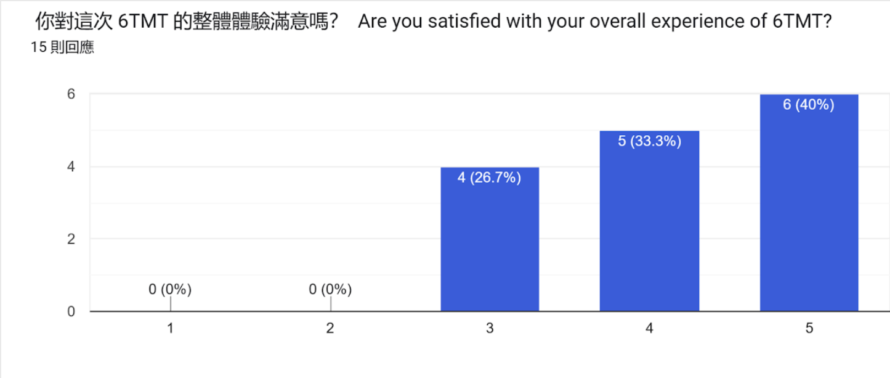
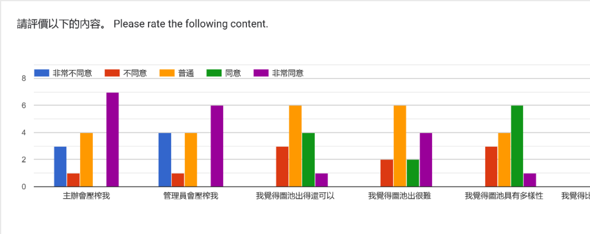
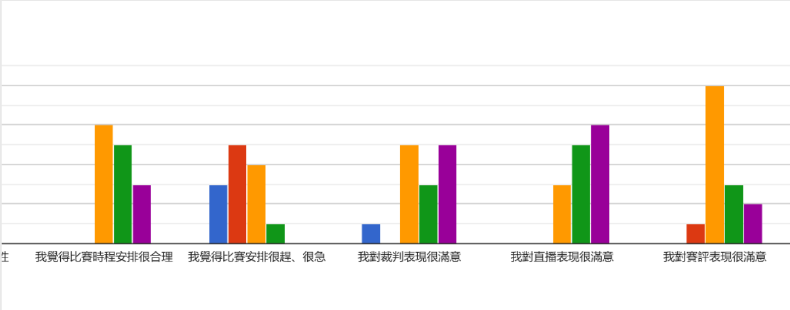
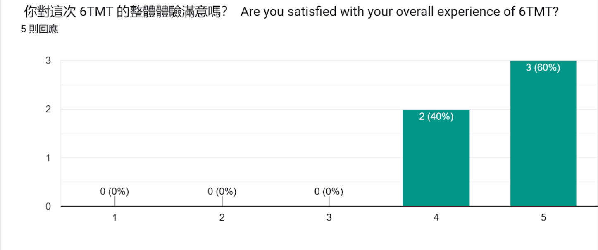
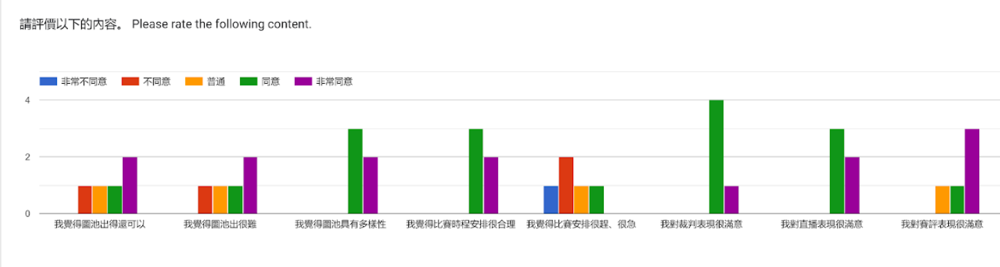

## 前言
感謝大家參與本次的6TMT，無論你自己的比賽成績滿不滿意，或者是員工們的表現如何，願意投入在這「小圈圈」的比賽其實不多，希望大家能持續關注之後6WC台灣代表隊的表現。

回饋的部分，我其實有點氣餒，就是玩家填回饋表單的數量是員工的1/3倍，有可能工作人員為了抽獎才導致Staffs的填答率比玩家高。雖然不強迫每個玩家都要填，但是希望給出一些建設性意見可以有助於主辦甚至是整個工作人員調整的方向。

我辦比賽不是因為我有後山或者是石油(這些我真的都沒有)，只是希望六位數的玩家們能透過比賽互相競爭、進步，也順便開放一些五位數來拉高強度。有沒有達到效果我不知道，但未來的 6WC 也許會給我答案。

不論你之後如何，我希望你在6TMT後有著收穫，實力上的進步或者是工作經驗的提升都是你在這裡得到的收穫。

## 圖表
### 6TMT Staffs

:::tip[回應]
先對於「主辦會壓榨我」的部分，我其實沒有介入很多事情，很多事情都是缺圖、沒有人做RP、或是缺裁判的狀況面臨6TMT停辦時我可能還在那裏叫人來救火，但最後還是解決了。總之，我其實不知道主辦該做哪些事，很多事都是其他人完成的，尤其是pdpd123幫我做了很多事。

至於「管理員會壓榨我」，兩個管理員都填非常同意，他們自己壓榨了自己。(?
:::

### 6TMT Players

:::tip[回應]
圖池不同level的人有者不同的看法，甚至出圖者有其他人完全不同的想法。至於難不難，我認為他們難度已經壓很多了，前幾輪都是著重在穩定導向，技術導向在第三輪和總決賽反倒是比較重。雖然我有否決他們選好圖池的權力，但我沒有介入很多，甚至很多圖也不是我推的。我得讚許圖池組和圖測製作出高質量的圖池，沒有他們這比賽真的會倒。

賽評我得說我要求很高，甚至為了給觀眾提升觀賞性某次進行大長文教育。說實在，玩家打得如何一般觀眾是很難感受的，賽評就是讓觀眾拉入感覺，讓觀眾有個觀賞體驗，因此，我很不希望賽評有著偏頗性的播報，或者是用詞不夠精確。
:::

## 回饋
> 尼克好帥
:::tip[回應]
好喔... 我長得帥不帥每個人有自己的標準，我覺得我長得醜就是了。然後我喜歡女生，我不是gay。
:::

> * osu比賽沒救了，尤其是所謂"正常"的比賽
> * 建議多一個叫做<緊急救火裁判>的職位
> * 建議加個quality assurance 
> * 下一屆改1v1 我會來選圖 但我不要head pooler
:::tip[回應]
沒辦法，TC有著自己的世界，手動審的比賽會面臨著「被噴眼紅天賦」或者是「不滿其他人過了罵主辦有吃X權，這些人幫主辦吃所以才過的嗎?」之類的。辦比賽很多都是靠熱情稱的，當工作人員也很多都是靠熱情繼續下去的。

確實，路克值得成為消防隊隊長。

給大家不知道QA(Mappool Quality Assurance)科普，很多「超」大型比賽都會設置這個職位，擔任這個工作都是看圖池品質如何，不同Playtester和selectors的是，他們只看圖品質好不好，「超」大型比賽在圖池組工作分配上其實分得很細，甚至有專門Replayers負責生產RP，Playtesters主要單純是測圖池對這個level有沒有太難，selectors就是從mappoolers推薦的一堆圖裡面選，Mappoolers只需要推薦圖。回到這個回饋，我們儘管是全台最大六位數國內賽事，但規模跟5TS比真的沒得比，自然而然我們只需要分成Mappoolers和Playtesters還有Mappers就行，QA真的給Mappoolers去做就足夠了。

做2v2是我個人的想法，如果有下一屆的話，考慮改成1v1。但你要做head pooler。:xdd:
:::

> 幫我辦offc6
:::tip[回應]
如果我說不要呢?
:::